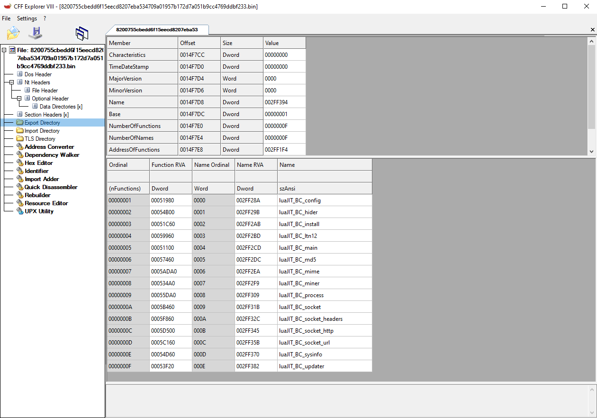
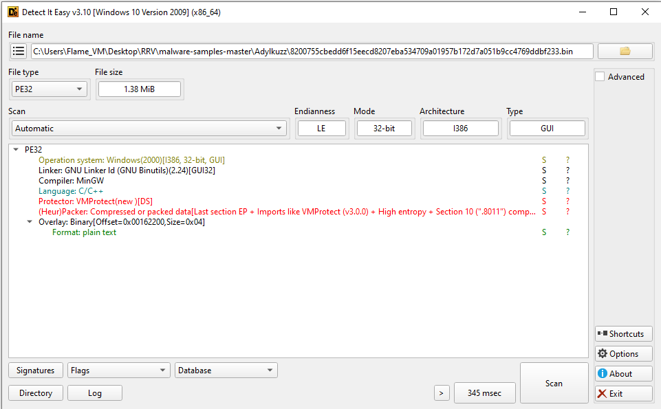

# Base analysis 

## Checking the Exports using CFF_Explorer VIII

First things first, let's check the export table.

The export table contains a few suspicious exports.  
I wouldn't trust a program that exports:
- `luaJIT_BC_hider`
- `luaJIT_BC_miner`

## Using DIE (Detect it easy) to check for possible known packing/protection

Packer : VMPROTECT (V3.0.0) 
For those who are unfamiliar with packers this one will encode the whole 'program' with a custom made function that will decode all the functions at runtime
up until this version you can run it and place a hook on each function call , dump the program find the new entry points and you'll have un unpacked executable 

sound easy ? 
it is... time costly.

